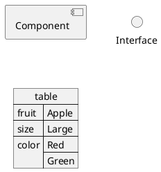

# Header 1
## Header 2
### Header 3
#### Header 4

At vero eos et accusamus et iusto odio dignissimos ducimus qui blanditiis praesentium voluptatum deleniti atque corrupti quos 
dolores et quas molestias excepturi sint occaecati cupiditate non provident, similique sunt in culpa qui officia deserunt mollitia animi, 
id est laborum et dolorum fuga. Et harum quidem rerum facilis est et expedita distinctio. Nam libero tempore, cum soluta nobis est 
eligendi optio cumque nihil impedit quo minus id quod maxime placeat facere possimus, omnis voluptas assumenda est, 
omnis dolor repellendus. Temporibus autem quibusdam et aut officiis debitis aut rerum necessitatibus saepe eveniet ut et 
voluptates repudiandae sint et molestiae non recusandae. Itaque earum rerum hic tenetur a sapiente delectus, ut aut reiciendis 
voluptatibus maiores alias consequatur aut perferendis doloribus asperiores repellat

**bold**
__alternative bold__

*italic*
_alternative italic_

~~strikethrough~~

```plantuml
node dog #orange
node cat #lightgreen
dog -[dotted]> cat: Hello
```

```plantuml
node "<color:white>node</color>" as b #purple
cloud "<color:black>zebra</color>" as w #lightblue
database thing as bu #cornsilk

b -> w : Sentence
w -> b : Another Sentence
b --> bu : "  Yet Another Sentence"
```

```python
print("hello world")
```

```rust 
fn fizzbuzz() {
    // `n` will take the values: 1, 2, ..., 100 in each iteration
    for n in 1..101 {
        if n % 15 == 0 {
            println!("fizzbuzz");
        } else if n % 3 == 0 {
            println!("fizz");
        } else if n % 5 == 0 {
            println!("buzz");
        } else {
            println!("{}", n);
        }
    }
}
```

> This is the first level of quoting.
>
> > This is nested blockquote.
>
> Back to the first level.

- bullet point
- another bullet point
    - nested bullet point
        - yet another nested bullet point

1.  This is a list item with two paragraphs. Lorem ipsum dolor
    sit amet, consectetuer adipiscing elit. Aliquam hendrerit
    mi posuere lectus.

    Vestibulum enim wisi, viverra nec, fringilla in, laoreet
    vitae, risus. Donec sit amet nisl. Aliquam semper ipsum
    sit amet velit.

2.  Suspendisse id sem consectetuer libero luctus adipiscing.

$\frac{1}{2}$ is a fraction 

$$\begin{align*}
  F(x) G(x)
    &= \left(\sum_{n \geq 0} f_n \frac{x^n}{n!}\right) \left(\sum_{n \geq 0}
      g_n \frac{x^n}{n!}\right) \\
    &= \sum_{n \geq 0} \sum_{0 \leq k \leq n} \frac{f_k}{k!}
    \frac{g_{n-k}}{(n-k)!} x^n \\
    &= \sum_{n \geq 0} \left(\sum_{0 \leq k \leq n} \binom{n}{k} f_k
      g_{n-k} \right) \frac{x^n}{n!} \\
    &= \sum_{n \geq 0} \left(\sum_{0 \leq k \leq n} f_k \cdot_B
      g_{n-k} \right) \frac{x^n}{n!}
\end{align*}$$

$\int_{t_0-\varepsilon}^{t_0+\varepsilon} f(t)\,\delta(t-t_0)\,\mathrm{d}t = f(t_0)$



That's all :rabbit: ...